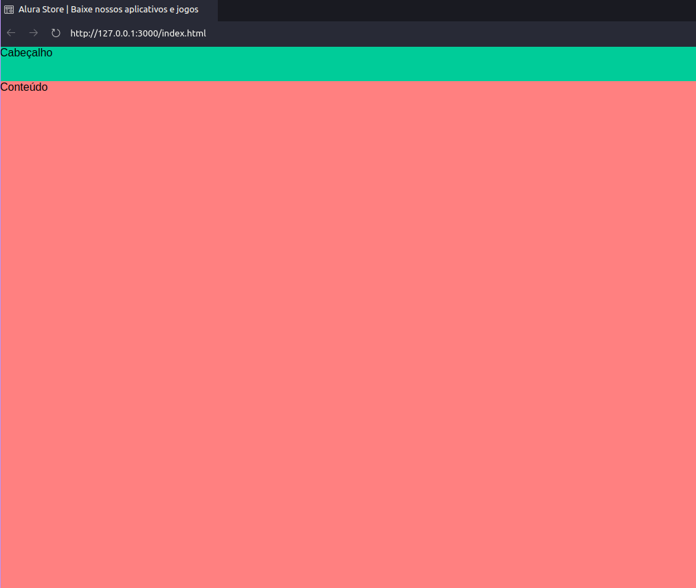
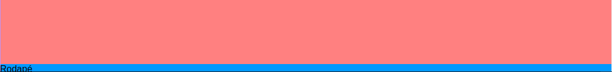
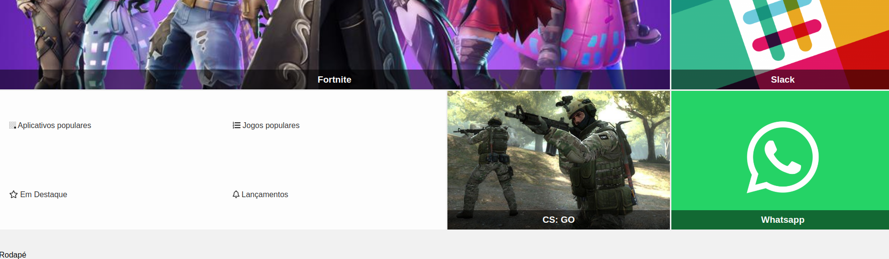
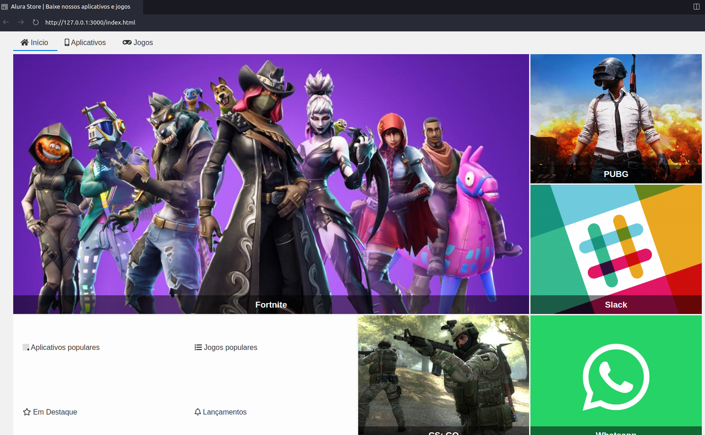
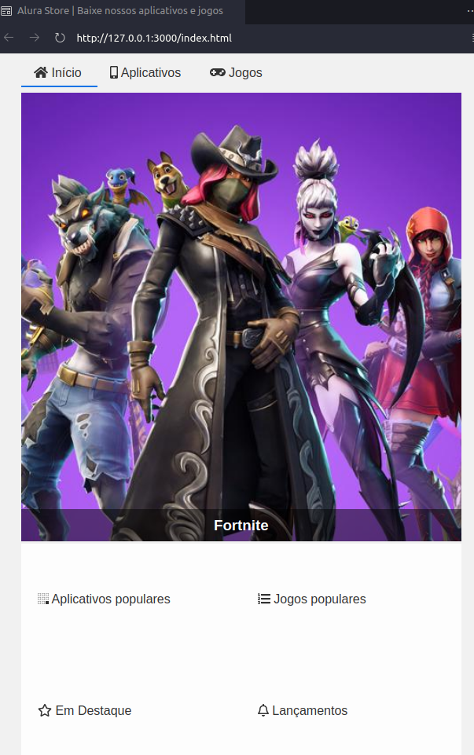
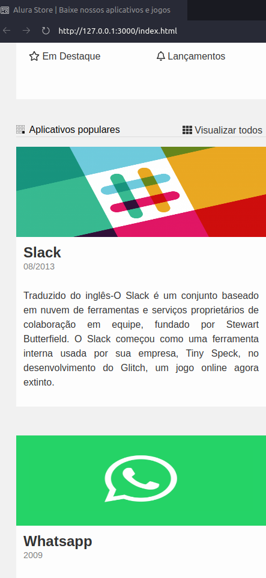

## Curso de CSS Grid: simplificando layouts

### ORACLE Next Education + Alura

#### INSTRUTOR: 
Matheus Castiglioni

GitHub Pages: 
[Acesse a página do projeto](https://tiagomerc.github.io/CSS-Grid-simplificando-layouts/)

**01. Definindo o layout base**

Nessa aula, aprendemos:

- Definir um template e criar áreas.

- Definir o tamanho das colunas.

- Definir o tamanho das linhas.

- Posicionar os elementos em suas áreas.

**02. Criando o layout da seção de destaques**

**Criando a seção de destaques e posicionando elementos**

**Estilizando destaques**

Nessa aula, aprendemos:

- Definir um template sem áreas.

- Definir a quantidade das colunas.

- Definir a quantidade das linhas.

- Dizer para os elementos onde devem começar e terminar.

- Definir espaçamento entre linhas e colunas.

**03. Estilizando a seção de populares**

Nessa aula, aprendemos:

- Que é possível haver um grid dentro de outro.

- Calcular largura.

**04. Estilizando o cabeçalho, menu e rodapé**

Nessa aula, aprendemos:

- Centralizar conteúdo.

- Adicionar bordas.

- Aplicar estilo no hover do mouse.

- Adicionar símbolo de copyright.

**Estilizando o cabeçalho**

**Conteudo do rodapé**

**05. Deixando o site responsivo** 

Nessa aula, aprendemos:

- Utilizar media queries para deixar site responsivo.

- Aplicar diferentes regras para diferentes telas.

**Print do cabeçalho**

**Print do conteudo**

